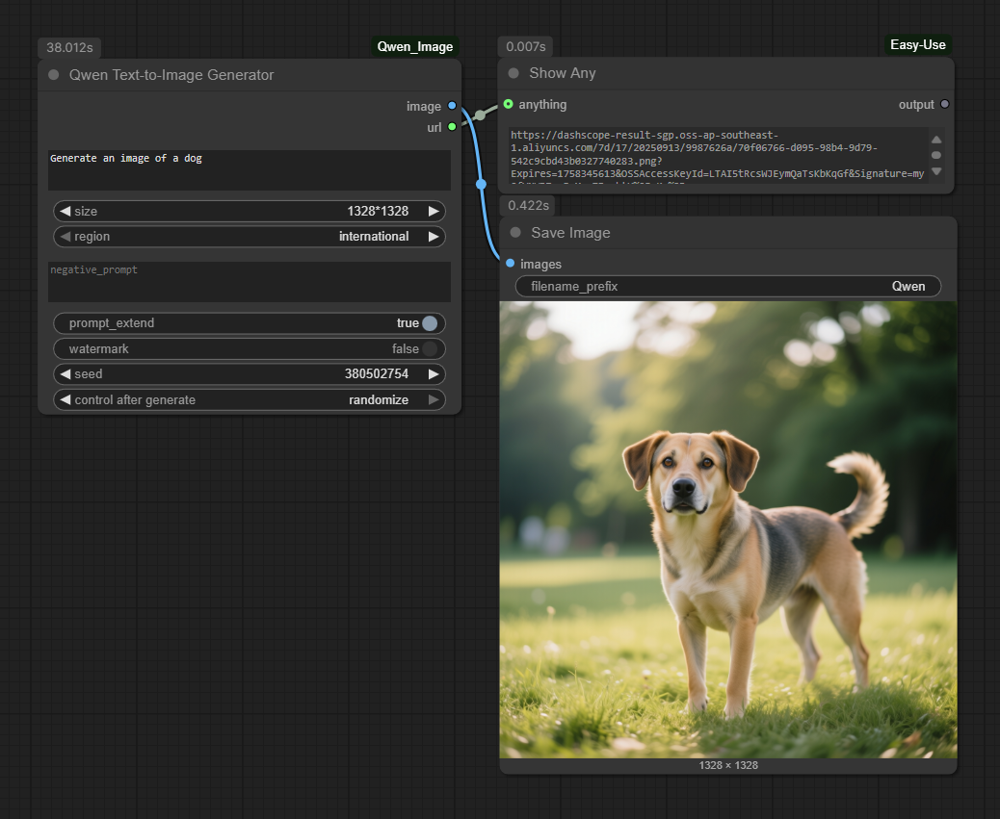
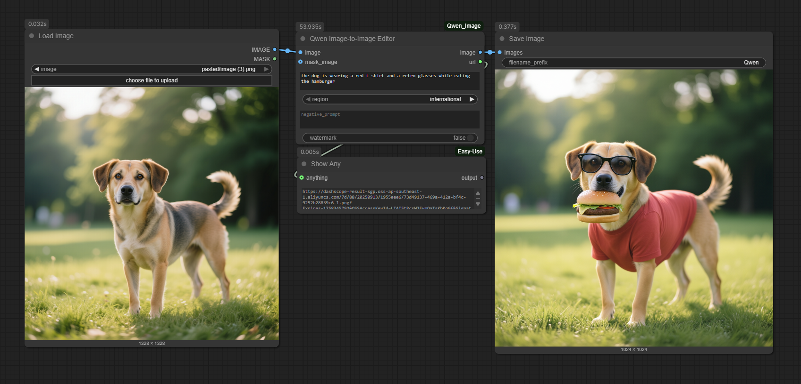

# ComfyUI_Qwen_Image

[](LICENSE)


A custom node for ComfyUI that provides **seamless integration** with the **Qwen-Image multimodal models** from **Alibaba Cloud Model Studio**. This solution delivers cutting-edge image generation and editing capabilities directly within ComfyUI.

### Why Choose Alibaba Cloud Model Studio?

This is a direct integration with Alibaba Cloud's Model Studio service, not a third-party wrapper or local model implementation. Benefits include:

- **Enterprise-Grade Infrastructure**: Leverages Alibaba Cloud's battle-tested AI platform serving millions of requests daily
- **State-of-the-Art Models**: Access to the latest Qwen-Image models (qwen-image and qwen-image-edit) with continuous updates
- **Commercial Licensing**: Properly licensed for commercial use through Alibaba Cloud's terms of service
- **Scalable Architecture**: Handles high-volume workloads with Alibaba Cloud's reliable infrastructure
- **Security Compliance**: Follows Alibaba Cloud's security best practices with secure API key management

## Important: API Costs & Authorization

⚠️ **This is a paid service**: The Qwen-Image models are provided through Alibaba Cloud's commercial API and incur usage costs. You will be billed according to Alibaba Cloud's pricing model based on your usage.

 **Model Authorization Required**: If you're using a non-default workspace or project in Alibaba Cloud, you may need to explicitly authorize access to the `qwen-image` and `qwen-image-edit` models in your DashScope console.

## Features

- Generate images from text T2I
- Edit existing images based on text instructions I2I
- Optional image masking for precise editing
- Configurable parameters: seed, resolution, prompt extension, watermark, negative prompts
- Powered by Alibaba Cloud's advanced Qwen-Image models

## Installation

1. Clone this repository to your ComfyUI custom nodes directory:
   ```
   cd ComfyUI/custom_nodes
   git clone https://github.com/ru4ls/ComfyUI_Qwen_Image.git
   ```

2. Install the required dependencies:
   ```
   pip install -r ComfyUI_Qwen_Image/requirements.txt
   ```

## Setup

### Obtain API Key

1. Visit [Alibaba Cloud Model Studio](https://dashscope.console.aliyun.com/apiKey) to get your API key
2. Create an account if you don't have one
3. Generate a new API key

### Model Authorization (If Using Non-Default Workspace)

If you're using a workspace other than your default workspace, you may need to authorize the models:

1. Go to the [DashScope Model Management Console](https://dashscope.console.aliyun.com/model)
2. Find `qwen-image` and `qwen-image-edit` models
3. Click "Authorize" or "Subscribe" for each model
4. Select your workspace/project if prompted

### Set Environment Variable

Copy the `.env.template` file to `.env` in your ComfyUI root directory and replace the placeholder with your actual API key:
```
DASHSCOPE_API_KEY=your_actual_api_key_here
```

## Usage

### Text-to-Image Generation

1. Add the "Qwen Text-to-Image Generator" node to your workflow
2. Connect a text input with your prompt
3. Configure parameters as needed (seed, resolution, etc.)
4. Execute the node

### Image-to-Image Editing

1. Add the "Qwen Image-to-Image Editor" node to your workflow
2. Connect an image input
3. Provide a text instruction for editing
4. Optionally connect a mask image
5. Execute the node

## Node Parameters

### Text-to-Image Generator
- **prompt** (required): The text prompt for image generation
- **size**: Output image resolution (1664×928, 1472×1140, 1328×1328, 1140×1472, 928×1664)
- **negative_prompt**: Text describing content to avoid in the image
- **prompt_extend**: Enable intelligent prompt rewriting for better results
- **seed**: Random seed for generation (0 for random)
- **watermark**: Add Qwen-Image watermark to output

### Image-to-Image Editor
- **prompt** (required): Text instruction for editing the image
- **image** (required): Input image to edit
- **mask_image** (optional): Mask defining areas to edit
- **negative_prompt**: Text describing content to avoid in the edited image
- **watermark**: Add Qwen-Image watermark to output

## Examples

### Text-only Generation
Prompt: "Generate an image of a dog swimming under the water"



### Image Editing with Mask
Edit an existing image by applying a mask to specify which areas to modify:
- Original Image: a dog swimming under the water
- Mask: None
- Prompt: "the dog is wearing scuba diving outfit and accessories"



## Security

The API key is loaded from the `DASHSCOPE_API_KEY` environment variable and never stored in files or code, following Alibaba Cloud security best practices.

## License

This project is licensed under the MIT License - see the [LICENSE](LICENSE) file for details.